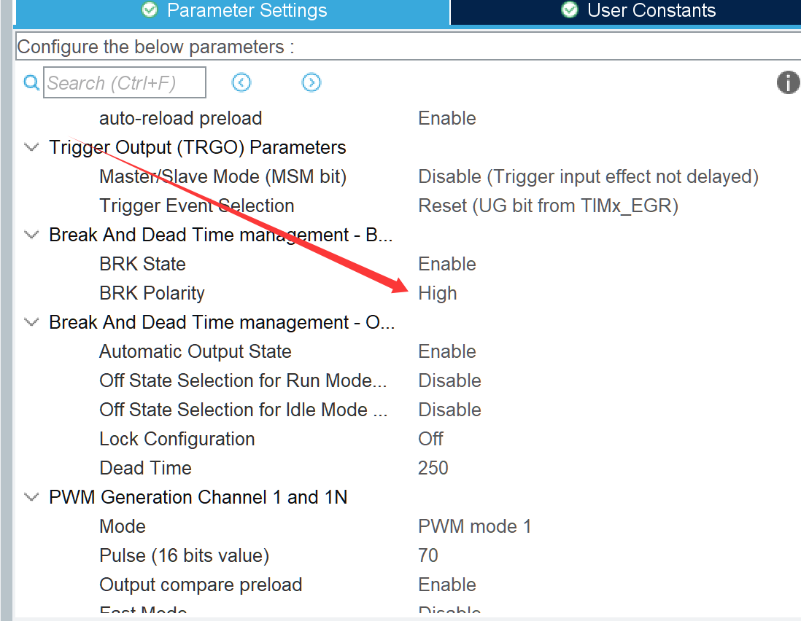
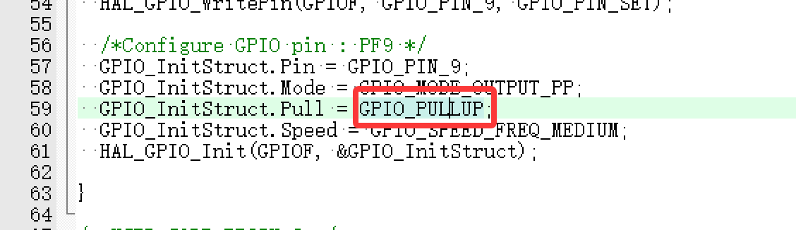

+++
date = '2025-05-24T12:09:21+08:00'
draft = false
title = 'CubeMX关于刹车输入的一个小BUG'
+++
STM32CUBEMX在配置定时器PWM输出的刹车输入引脚时

要注意配置的刹车极性和对应引脚的上下拉模式是否相反

若不相反，则会导致复位启动时无法产生对应的波形。

经排查，是CUBEMX没有对刹车输入引脚进行正确的初始化，需要手动更改

